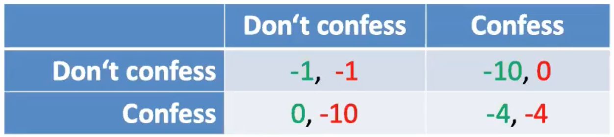
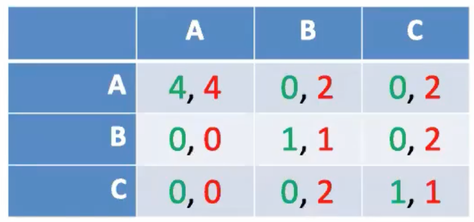
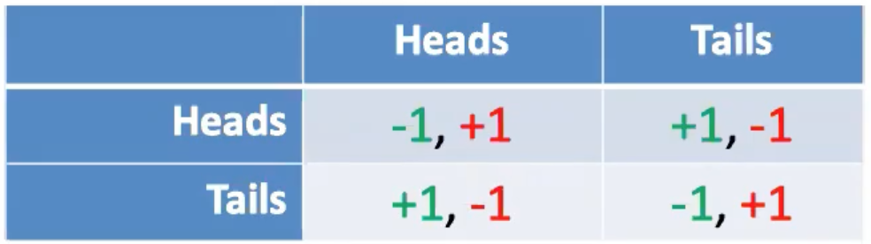

including: Pure Strategy and Mixed Strategy

Game Theory（博弈论）
=====

study  on the situation on which multiple participants interact or affect on each other's outcome.

***Assumptions:***

- The payoff for a player should capture all rewards

- Players know all possible strategies and payoffs to other players (not always true)

- Players are rational
  - Try to maximum their own payoff.
  - succeed in picking the optimal strategy.

## Pure strategy（纯策略）

### Situation in which players have a dominant strategy

***Example:*** The prisoner's dilemma:

- if neither confesses, both get 1year sentence
- if one confesses, other person get 10 years
- if both confess, 4 years in prison each.

***Behavior:***

- Each player has a strictly dominant strategy. (**confess**)

- not matter what your parter does, you should insist on **confessing**.
- but both could be better off.(**not confess**)

***Formal definition:***

- Player 1 chooses strategy $S$.

- Player 2 chooses strategy $T$.
- Payoff to player $i$ given $S$,$T$ is $P_i(S,T)$
- ***Def:*** $S$ is a best responce to player 1 if $P_1(S,T) \geq P_1(S^{'},T)$ for all other stategies $S^{'}$ of player 1.
- $S$ strict best response when $P_1(S,T) \geq P_1(S^{'},T)$.

### Situation in which players don't have a dominant strategy

Player 1's A is the best response to player 2's A.

Player 1's B is the best response to player 2's B.

Player 1's C is the best response to player 2's C.

### Equilibrium concept（纳什均衡）

***Def:*** For strategy $S$ by player 1 and $T$ by player 2, the pair $(S,T)$ is a Nash equilibrium if $S$ is a best response to $T$, and $T$ is a best response to $T$. 

- No player wants to unilaterally(done only by one player) deviate to an alternative strategy.

- It is also unique, no other pair works except coordination game.

### Coordination game (协调博弈)

***Def:***  Every player receive the same reward.

both powerpoint or both keynote are Nash equilibrium.

Coordination game has **multiple Nash equilibria**. 

***Def:*** A game consists of three things.

- A set of **players** that Indexed by $i$, where $i \in \{1,\dots,n\}$.
- Each player has set of options how to behave called **strategies** , let $S_i$ denote the set of strategies available to player $i$ and let $s_i \in S_i$ denote an arbitrary member of this set.
  - $(s_1,s_2,\dots,s_n)$ denotes a combination of strategies.
-  For each choice of strategies, each player receives a **payoff** from the game. Let $u_i(s_1,\dots,s_n)$ be the payoff to player $i$ if the players choose the strategies.

Thus, a n-player game is specified by the players' strategy space and utility functions $(s_1,\dots,s_n)$

$$G=\{S_1,\dots,S_n;u_1,\dots,u_n\}$$

The dominant strategy is said to dominate all other strategies.
$$u_i(s_1,\dots,s_{i-1},s_i^{'},\dots,s_n)\geq u_i(s_1,\dots,s_{i-1},s^{''}_i,\dots,s_n)$$

The strategies $(s_1^{\*},\dots,s_n^{\*})$ are a **Nash equilibrium**. Where $s_i^{\*}=argmax_{s_i\in S_i}u_i(s_1^{\*},\dots,s_{i-1}^{\*},s_i^{\*},\dots,s_n^{\*})$

## Mixed strategies（混合策略）

***Example:*** **zero-sum** game in which has no equilibrium in the pure strategy space.

**KEY:** Choose a probability you will choose H instead of choosing H or T directly.

​	Therefore, payoff is an expected value.

Suppose player 1 evaluates pure strategies:

- Player 2 meanwhile chooses strategy q.
- If player 1 chooses H, he will gets a payoff of -1 with probability q and +1 with probability 1-q.
- If player 2 chooses H, he will gets a payoff of -1 with probability 1-q and +1 with probability q.

Then, pick H: expect **1-2q**, pick T expect **2q-1**.

***Def:*** Nash equilibrium for mixed strategies.

- A pair of strategies(now probabilities) such that each is a best response to the other.
- Thm: Nash proved that this always exists.

If **1-2q** $\neq$ **2q-1**, player 1 must have a pure strategy which is a unique best response to player 1, but this is not the best response for player 2.
So must have **1-2q** $=$ **2q-1** in any Nash equilibrium, which gives q=0.5.

### Nash equilibrium

Let $S_i$ denote the set of all strategies for player $i$, let $\Sigma_i$ denote the set of probability measures over the pure strategy set $S_i$. Use $\sigma_i \in \Sigma_i$ to denote the mixed strategy of player $i$. Then use $\sigma\in\Sigma=\prod_{i\in I}\Sigma_i$ to denote a mixed strategy profile. Define $\sigma_{-i}\in\Sigma_{-i}=\prod_{j\neq i}\Sigma_j$ as the mixed strategy profile except player $i$.

Following expected utility theory, the payoff function is $u_i(\sigma)=\int_{S}u_i(s)d\sigma(s)$.

## Cournot Model of Duopoly

***Example:*** 

- $n$ number of ISPs offer their serivice (Bandwidth) to the customers.

- The cost to ISP $i$ of producing $q_i$ units of the Bandwidth is $C_i(q_i)$, where $C_i$ is an increasing function.
- The Bandwidth is sold at a single price $P(Q)$ where $Q$ is the total output and $P$ is a decreasing function unless it is already zero.
- If the output of each lSP $i$ is $q_i$, then the price is $P(q_1+\dots+q_n)$, so revenue of $i$ is $q_iP(q_1+\dots+q_n)$
- Thus ISP $i$'s profit, equal to its revenue minus its cost, is
  $$F_i(q_1,\dots,q_n)=q_iP(q_1+\dots+q_n)-C_i(q_i)$$
- The lSP Games:
  - Players: the lSPs.
  - Actions: the set of its possible outputs $q_1,\dots,q_n$.
  - Utilities: ISPs preferences are represented by their profits $F_1,...,F_n$.

***Processing:***

Every ISP wants to get maximum value of $F_i(q_1,\dots,q_n)$, then for each $i$, there is $\frac{\partial F_i}{\partial q_i}=0$. At last, we can get $q_i$ by these formula.

