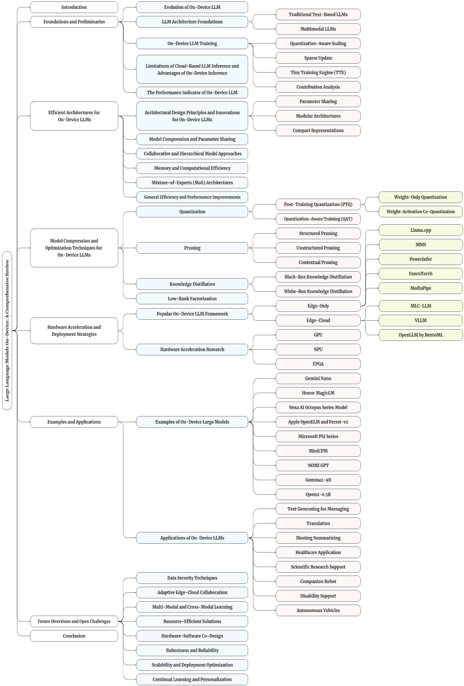
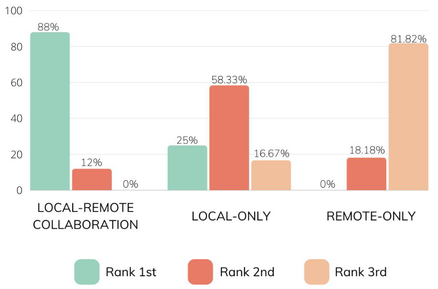
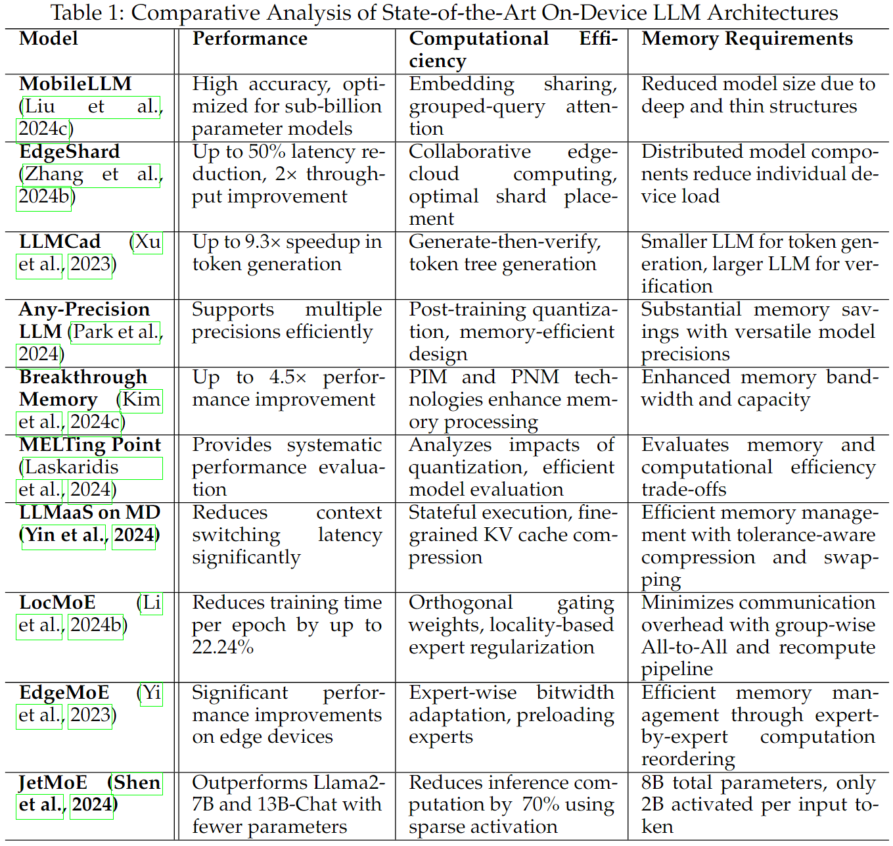
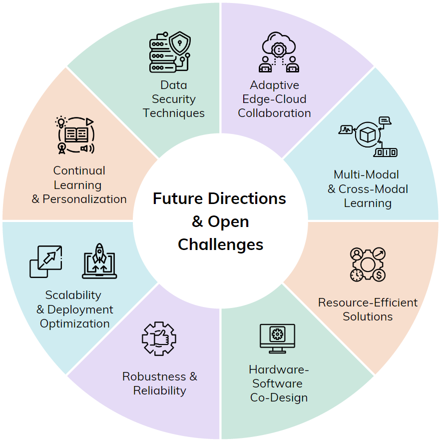

including paper: On-Device Language Models: A Comprehensive Review

title: On-Device Language Models: A Comprehensive Review
=====

## Foundations and Preliminaries

significant challenges: limited computational power, reduced memory capacity, energy constraints

challenges: limited memory and computational power

solutions: distributing computational load and utilizing models with varying capabilities

Classic methods for training on resource-constrained devices include:

- Quantization-aware scaling(量化感知缩放): **automatically scaling** the gradients of tensors with **different** bit precisions, solve the problem of inconsistent gradient scales of tensors with different bit widths in the quantization graph, and make the training accuracy of the quantized model comparable to that of the floating-point model.
- Sparse update(稀疏更新): **Selectively update** the weights of a portion of the layers in the network, **skip** the gradient calculations of less important layers and sub-tensors, thereby reducing memory usage and computational costs
- Tiny Training Engine (TTE)(微型训练引擎): Includes redundant nodes in the reverse graph, such as gradient nodes that **freeze weights**, and **reorder operations** to achieve **in-place** updates.
- Contribution analysis(贡献分析): **Automatically determine** the sparse update scheme, that is, determine which **parameters (weights/biases)** contribute the most to downstream accuracy, so as to select which layers or parts of tensors should be updated under a limited memory budget.

​						Figure: Vote Distribution of different LLM deployment strategies in Personal LLM strategies

main concerns:

- the high latency of remote LLM service
- the risk of transmitting personal data to the cloud
- the cost of cloud-based LLM services

**Latency** is the time it takes from the user inputting a request to the system starting to respond. It usually refers to the time from when the model receives the input text to when it starts generating the first output. We generally use TTFT (Time-to-First-Token) to measure this metric.

**Inference speed** refers to the speed at which the LLM makes an autoregression prediction of the next token based on all the previous tokens seen so far.

**The size of RAM/VRAM used** is also one of the performance indicators of language models operation.

**the storage space** occupied by models and the **energy consumed** during inference.

## 3. Efficient Architectures for On-Device LLMs

### Architectural Design Principles and Innovations for On-Device LLMs

Designing language models for on-device deployment involves several architectural principles and innovations aimed at overcoming the resource constraints typical of mobile and edge devices. Key strategies include

1. parameter sharing：LLM的不同部分重用权重以减少总体参数数量。
2. modular architectures：将LLM分解为更小的、独立的组件或模块，可以单独或并行处理。
3. compact representations：通过量化和权重修剪等技术减少 LLM 的内存占用。

- Model Compression and Parameter Sharing(模型压缩和参数共享)
- Collaborative and Hierarchical Model Approaches(协作和分层模型方法)

- Memory and Computational Efficiency(内存和计算效率): enhancing memory and computational efficiency for on-device LLMs.
- Mixture-of-Experts (MoE) Architectures: offer a promising approach for deploying LLMs on edge devices by leveraging sparse activation and dynamic routing to improve efficiency.
- General Efficiency and Performance Improvements. e.g. Any-Precision LLM proposes a novel method to **deploy** various LLMs with different precisions in a memory-efficient manner.

## Model Compression and Optimization Techniques for On-Device LLMs

key model compression techniques: quantization, pruning(修剪), knowledge distillation, and lowrank factorization.

**Quantization** in neural networks refers to the process of transforming high-precision (floating-point) weights and activations into lower bit-widths (integers).

- Post-training quantization (PTQ) :PTQ is applied after model training, requiring no retraining and thus being faster and less resource-intensive than quantization-aware training (QAT).

  - Weight-only quantization: only the weights of the neural network are quantized

  - Weight-activation co-quantization: Both weights and activations are quantized

- Quantization-aware training (QAT): QAT incorporates quantization directly into the training process, allowing the model to accommodate the reduced precision constraints inherently.

**Pruning** in neural networks involves selectively removing weights or neurons to reduce complexity and enhance computational efficiency without significantly compromising performance.

- Structured Pruning: This approach **removes entire subsets of parameters** like layers, channels, or filters, which is beneficial for hardware optimization due to more regular memory access patterns and simplified computations.

- Unstructured Pruning: Unstructured pruning **removes individual weights** across the model, offering finer granularity and potentially higher compression rates, typically results in sparse matrices.

- Contextual Pruning: This advanced method prunes based on the operational context of the model, targeting weights or neurons that are only relevant under specific conditions or for particular tasks.

**Knowledge Distillation (KD)** is a technique for transferring knowledge from a large, computationally intensive model (teacher) to a smaller, more efficient model (student).

- Black-box Knowledge Distillation: This approach involves the student model learning solely from the outputs of the teacher model, **without access to its(teacher) internal** mechanics or parameters.

- White-box Knowledge Distillation: White-box Knowledge Distillation allows the student model to **access the internal states and workings of the teacher**, facilitating a deeper and more precise learning process.

**Low-Rank Factorization (LRF)** is a technique utilized to decompose matrices into smaller components, significantly reducing computational complexity without substantially impacting model accuracy.

## Hardware Acceleration and Deployment Strategies

skip.

## Future Directions and Open Challenges

### Data Security Techniques

Skip

### Adaptive Edge-Cloud Collaboration(自适应边云协作)

- Inventing **advanced caching and request analysis** techniques, including sophisticated vector database caching strategies, feature extraction models for diverse LLM requests (Yao et al., 2024c), and uncertainty-guided token sampling methods to optimize data transmission between edge devices and cloud servers (Wang et al., 2024a).
- **!!!** Designing **intelligent scheduling and resource allocation algorithms**, incorporating personalized inference scheduling (Yao et al., 2024c), adaptive resource allocation for heterogeneous infrastructures (Yang et al., 2024c), and batch size-aware optimization techniques to efficiently distribute LLM components and workloads across edge-cloud environments (Zhang et al., 2024b).
- Creating **efficient knowledge transfer and model compression methods**, such as adapter-based knowledge distillation for multimodal LLMs (Zhang et al., 2024f), dynamic quantization techniques for various LLM architectures, and adaptive weight update compression strategies to enable effective deployment of language models on resource-constrained devices (Wang et al., 2024a).
- Improving **performance optimization** in collaborative systems by developing **adaptive control mechanisms** for token-level collaboration (Yang et al., 2024c), efficient constraint satisfaction algorithms for real-time decision-making, and innovative techniques to reduce latency and improve pipeline execution in hybrid edge-cloud systems (Hao et al., 2024; Zhang et al., 2024b).

### Multi-Modal and Cross-Modal Learning

- Developing efficient multi-modal processing and compression techniques.
- Enhancing knowledge transfer and adaptation capabilities.
- Expanding modality support and improving multi-modal understanding.

### !!! Resource-Efficient Solutions

- Creating efficient model compression and execution algorithm.

- Exploiting model sparsity.

- Developing **energy-aware training and deployment strategies**, including energy-efficient algorithms and runtime optimizations (Bai et al., 2024). Explore adaptive parameter-efficient fine-tuning methods that balance security, energy efficiency, and performance on edge devices (He et al., 2024).

### Hardware-Software Co-Design

skip

### Robustness and Reliability

skip

### Scalability and Deployment Optimization

- !!! Developing **dynamic resource allocation and load balancing techniques** for distributed LLM inference across heterogeneous edge devices (Yang et al., 2024c; Wilkins et al., 2024).
- Investigating **optimization strategies for reducing latency and improving throughput** in collaborative edge computing scenarios, potentially leveraging techniques such as model sharding (模型分片) and pipelined inference(管道推理) (Zhang et al., 2024b; Dhar et al., 2024).
- Exploring **efficient methods for managing and updating multiple LLM versions** across diverse edge devices, considering factors such as network constraints and device capabilities. Building cyber-infrastructure to enhance the reusibility and reproducibility of models and datasets (Wolf et al., 2019; Lhoest et al., 2021; Deng et al., 2019).
- Designing **efficient strategies for edge computing and multi-device systems**, including dynamic sparse tree optimization (Luk et al., 2024), adaptive bit-width techniques, and energy-aware co-design approaches.

