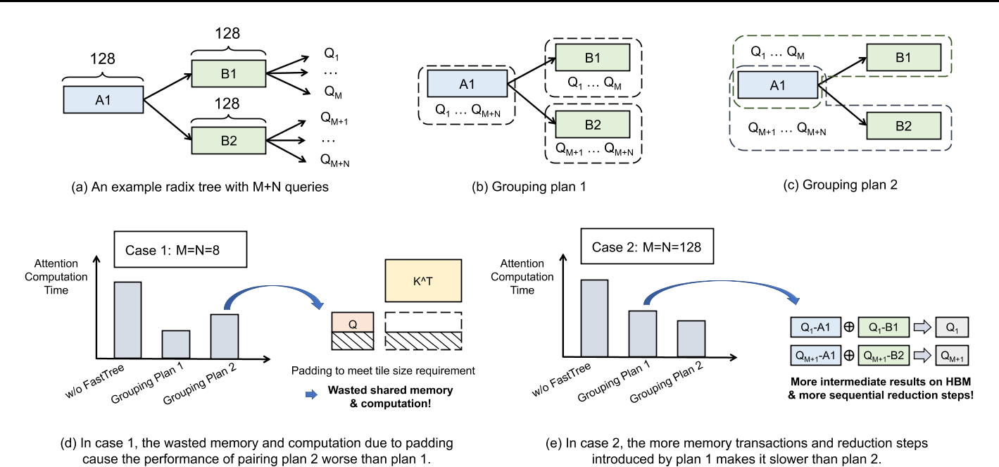
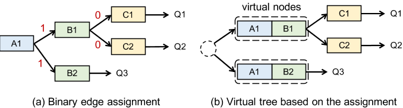
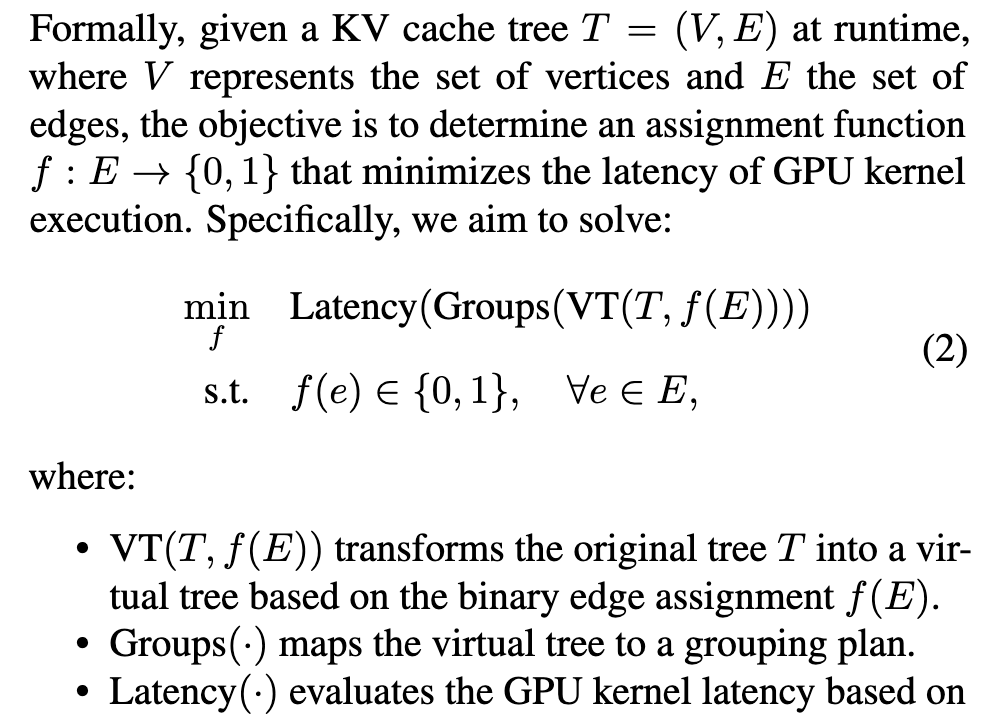
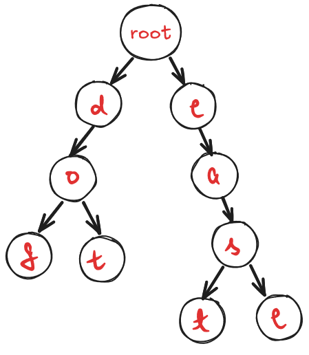
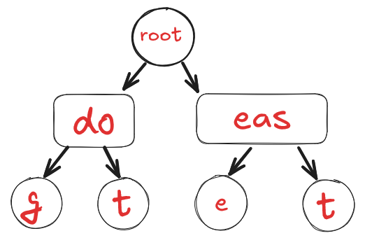
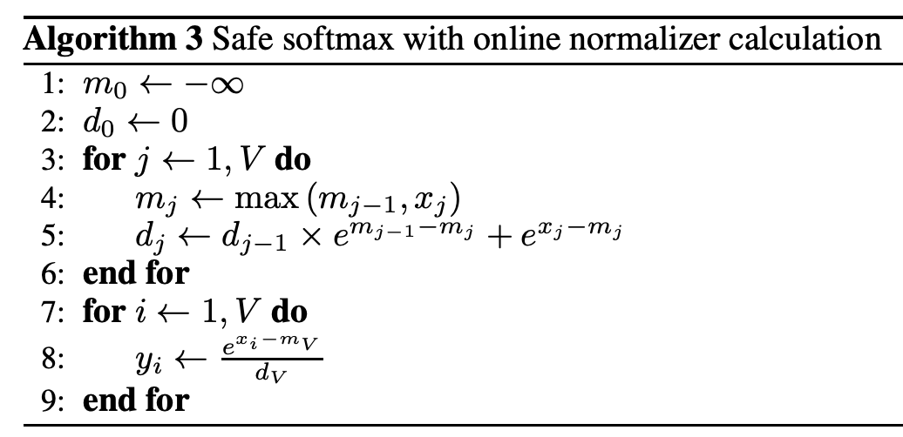
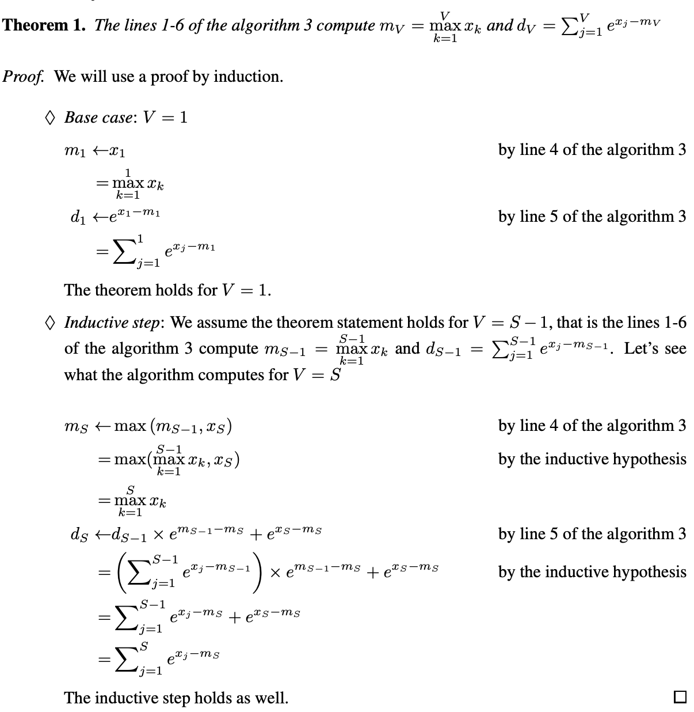

including paper: [FastTree: Optimizing Attention Kernel and Runtime for Tree-Structured LLM Inference](https://mlsys.org/virtual/2025/poster/3278)

# 问题与挑战

论文旨在解决一个核心矛盾：

**现有LLM服务系统（如SGLang）虽然通过基数树在内存层面高效地共享了KV缓存，但其注意力计算内核却完全忽略了这种树状结构，仍然采用“查询分离”的计算模式，导致了严重的性能问题。**

**计算模式**：将每个查询的KV缓存拼接起来，并**分派到独立的GPU线程块**中进行计算。

**由此带来的两大性能问题**：

1. **冗余全局内存访问**：即使KV缓存被多个查询共享，每个线程块仍需将其从慢速的全局内存中重复加载，无法利用快速的片上共享内存进行复用。
2. **GPU Tensor Core 利用率极低**：在解码阶段，每个查询的Q向量是单个令牌，其与KV缓存的计算是矩阵-向量乘法。这无法满足Tensor Core高效执行所要求的矩阵形状，导致只能使用效率低下的CUDA核心，或通过填充引入大量无效计算。

# 问题模型

## 内容查询分组

不同的分组方法在不同的配置环境里效果不同。

## 决策空间

论文提出的方法就是formulate the problem as a binary edge-assignment task.：**为树中的每一条边分配一个二进制值（0或1）。**

- **`f(edge) = 1`**：表示这条边所连接的两个节点**被“连接”**。在计算时，父节点的上下文会和子节点的上下文**拼接**在一起，作为一个整体上下文来处理。
- **`f(edge) = 0`**：表示这条边被**“切断”**。父节点和子节点将被视为两个独立的上下文组。

# 解决方法

## **基于开销的贪心启发式算法**

- 由于树结构是动态变化的，需要一种轻量级的在线搜索方法。
- 使用 **广度优先搜索（BFS）** 遍历树，对每条边评估两种赋值方式的“开销”，选择开销较小的方案。
- 开销主要来自两方面：

### 1. 填充开销

当查询数量或上下文长度不能被GPU的**tile大小**整除时，最后一个tile会有未充分利用的空间，这部分就是**填充**。填充会导致：

- **共享内存浪费**：本该用于缓存更多数据的内存被闲置。
- **计算浪费**：Tensor Core对填充区域进行了无效计算。

#### a) 计算填充区域大小

定义一个函数 $\text{Pad}(TS, N)$，用于计算在给定tile大小 $TS$ 和实际维度大小 $N$ 时，需要填充的元素数量。

$\text{Pad}(TS, N) = TS - ((N - 1) \% TS + 1)$

**解释**：

- $(N - 1) % TS + 1$ 计算的是最后一个不完整的tile里有多少个**有效元素**。
- 用 $TS$ 减去这个值，就得到了需要**填充的元素数量**。

**例子**：如果 $TS=16$（一个tile处理16个查询），$N=20$（总共有20个查询）：

- 最后一个tile有效元素：$(20-1)%16 + 1 = 19%16 + 1 = 3 + 1 = 4$
- 填充元素：$16 - 4 = 12$
- 这意味着最后一个tile有75%(12/16) 的计算和内存被浪费了。

#### b) 查询维度的填充开销

$C_{P,q}(nQ, len) = \text{Pad}(TS_q, nQ) \cdot len \cdot d$

**解释**：

- $\text{Pad}(TS_q, nQ)$：在查询维度上需要填充的**查询数量**。
- 对于每一个被填充的“虚拟查询”，它都需要与整个上下文长度 $len$ 和注意力头维度 $d$ 进行计算和内存访问。
- 所以总开销是这三者的乘积。这近似地代表了因查询维度填充而导致的**冗余内存访问量和浮点计算量**。

#### c) 上下文维度的填充开销

$C_{P,c}(nQ, len) = nQ \cdot \text{Pad}(TS_c, \text{min}(len, TS_c)) \cdot d$

**解释**：

- 这里有一个关键点：$\text{min}(len, TS_c)$。这是因为上下文长度 $len$ 在树遍历过程中会通过拼接而增长。一旦 $len$ 超过tile大小 $TS_c$，填充开销就难以在每一步精确估计，所以只考虑当前步的、不超过tile大小的部分。
- $\text{Pad}(TS_c, \text{min}(len, TS_c))$：在上下文维度上需要填充的**上下文token数量**。
- 对于所有 $nQ$ 个查询，每个都需要处理这些填充的上下文token，并与头维度 $d$ 交互。
- 所以总开销是这三者的乘积。

#### d) 综合填充开销

$C_P(nQ, len) = α \cdot C_{P,q}(nQ, len) + β \cdot C_{P,kv}(nQ, len)$

**解释**：

- 将查询维度和上下文维度的填充开销加权求和。
- $α$ 和 $β$ 是**经验系数**，需要通过在实际硬件（如H100 GPU）上进行分析来确定，以反映两种开销对最终延迟的相对影响程度。

### 2. 中间结果开销

当选择**不拼接**上下文（即“分割KV”）时，一个完整的注意力计算会被拆分成多个独立的组（GPU线程块）来处理。这会引入额外开销：

1. **全局内存读写**：每个组计算的部分结果（如未归一化的注意力分数和输出）需要写回全局内存。
2. **后续归约步骤**：需要启动额外的轻量级GPU内核，将这些部分结果进行归约，得到每个查询的最终输出。

$\text{SplitKVCost}_R = γ \cdot nQ_l \cdot d$

**解释**：

- $nQ_l$：当前正在处理的子节点 $l$ 所关联的查询数量。
- $d$：注意力头维度。
- $γ \cdot nQ_l \cdot d$：这个公式非常简化，它用 $nQ_l \cdot d$ 来近似表示因分割而产生的**中间结果元素总量**。
- $γ$ 是另一个**经验系数**，用于将这个数据量转化为对延迟的估计。它涵盖了全局内存访问和额外内核启动的开销。

### 3. 两种选择的最终开销计算

在贪心算法中，对于边 $v -> l$（父节点 $v$ 到子节点 $l$），需要比较两种选择的成本：

#### 选择一：分割KV（不拼接，赋值0）

$\text{SplitKVCost} = \text{SplitKVCost}_P + \text{SplitKVCost}_R$

其中：

- $\text{SplitKVCost}_P = C_P(nQ_{curr}, len_v) + C_P(nQ_l, len_l)$
  - 父节点和子节点作为两个独立的组，分别计算它们的填充开销。
- $\text{SplitKVCost}_R = γ \cdot nQ_l \cdot d$
  - 由于分割，产生了中间结果开销。

#### 选择二：分割查询（拼接，赋值1）

$\text{SplitQCost} = C_P(nQ_{curr} - nQ_l, len_v) + C_P(nQ_l, len_v + len_l)$

**解释**：

- 拼接后，原本属于父节点 $v$ 的查询被分成了两部分：
  1. 一部分 ($nQ_{curr} - nQ_l$) 仍然只与父节点的上下文 $len_v$ 组成一个组。
  2. 另一部分 ($nQ_l$) 与拼接后的长上下文 $len_v + len_l$ 组成另一个组。
- 因此，需要计算这两个新组的填充开销。
- **注意**：选择拼接避免了中间结果的开销，因为每个组都包含了计算最终输出所需的全部上下文。

### GPU 高效长上下文分割（Long Context Splitting）

- 在某些情况下，即使优化了分组，GPU 仍可能利用率不足，原因包括：
  1. **块级并行度不足**：线程块数量少于 GPU 容量；
  2. **长尾效应**：某些上下文过长，导致部分线程块执行时间过长。
- 解决方案：**动态分割长上下文节点**，以增加并行度并平衡负载。

## 内核设计

现有内核（如 FlashAttention、FlashInfer(**存疑**？）为**每个查询**启动一个独立的线程块进行处理。这种模式导致：

1. **冗余全局内存访问**：共享的KV缓存被每个查询的线程块重复加载。
2. **Tensor Core 利用率低**：解码时每个查询的Q是单个向量，导致计算是矩阵-向量乘法，而非Tensor Core擅长的矩阵-矩阵乘法。

FastTree 内核的根本转变在于：**为一个“上下文-查询组”启动一组线程块**。该组包含一个共享上下文和多个查询。

### 内核设计详解

#### 1. **“一核多用”的并行架构**

- **整体设计**：使用**单个GPU内核**来处理整棵树上所有不同的上下文-查询组。
- **并行策略**：每个组被分配到一个**线程块集合** 上执行。
  - **好处1：提升并行度**：将一个树上的所有不同组的计算集中到一个内核中，增加了同时活跃的线程块数量，能更好地占满GPU的流式多处理器。
  - **好处2：消除内核启动开销**：避免了为每个查询或每个组单独启动内核的昂贵开销。

#### 2. **类 FlashAttention 的组内处理**

在一个线程块内部，对于分配给它的那个“上下文-查询组”，其计算过程借鉴了 FlashAttention 的“**tile-by-tile**”和“在线SoftMax”思想，但关键区别在于**查询被聚合了**。

- **Q矩阵tile-by-tile**：将组的Q矩阵在**查询维度**上进行分割。每个Q tile被分发到不同的线程块中**并行处理**。
- **KV矩阵迭代**：对于每个线程块，它需要**顺序迭代**整个上下文长度上的K和V tile。这是因为注意力输出在上下文维度上存在依赖关系，必须看到所有上下文信息后才能得到最终结果。
- **数据搬运与重用**：将当前需要的Q、K、V tile从全局内存加载到**快速的共享内存**中。
  - **核心优化点**：对于同一个Q tile内的所有聚合查询，它们**共享同一份K tile**。这份K tile只需从全局内存加载**一次**，即可被所有查询复用。这极大地减少了了对全局内存的访问。
- **Tensor Core 激活**：由于现在每个Q tile包含**多个查询**（例如16个），它与K tile的计算从**GEMV** 变成了 **GEMM**。矩阵-矩阵乘法正是Tensor Core擅长且高效的计算模式，从而解决了Tensor Core利用率低下的问题。

#### 3. **中间结果与归约**

- 执行完上述注意力内核后，每个组会得到：
  - 一个中间输出矩阵 $\textbf{O}$
  - 一个 $LogSumExp$ 向量 $\textbf{L}$（用于在线SoftMax的数值稳定性）
- 这些结果被存储在全局内存中。
- 随后，FastTree 启动一个**轻量级的归约内核**，为每个查询整合所有相关组的中间结果，通过 $LogSumExp$ 向量进行重新缩放，得到最终的注意力输出。

#### 4. **Multi-phase tiling**

- **insight**：在树结构中，不同位置的节点特性不同。
  - **根节点附近**：聚合的查询数量多，适合使用**大的Q-tile尺寸**来最大化KV数据的复用。
  - **叶子节点附近**：聚合的查询数量少，如果使用大tile会导致共享内存浪费和SM占用率下降。此时应使用**小的Q-tile尺寸**。
- **实现**：FastTree 将树划分为多个阶段，对每个阶段使用**不同的内核**，这些内核预配置了不同的tile尺寸以适应其查询数量特征。
- **目标**：在**数据复用**和**GPU占用率**之间取得最佳平衡。

# 知识点

## 基数树（Radix Tree）

- **基本概念**：Radix树源于前缀树，通过**合并只有一个子节点的节点与其父节点**来节省空间，是一种**压缩后的前缀树**。例如，存储IP地址时，Radix树可以高效处理像 `192.168.1.0/24` 这样的可变长度网络前缀。
- **与相关结构的区别**
  - **与前缀树的区别**：普通前缀树为每个字符创建节点，可能浪费空间。Radix树通过**压缩单分支节点**优化了这一点。
  - **与Patricia树的关系**：这两个术语经常混用。狭义上，**Patricia树是Radix树的一种特例，其基数为2（即按位比较和分支）**。广义上，许多资料将两者视为同一概念，即**压缩前缀树**。（如：将`key`转为二进制`01101011 01100101 01111001`然后以01来分叉。）

## 长尾效应（long tail effect）

**动态输入长度不均等**

- **场景**：一批处理（Batch）中同时处理多个用户请求。
- **问题**：每个请求的输入提示（Prompt）长度和需要生成的输出（Output）长度差异巨大。
- **例子**：一批处理32个请求。其中31个请求生成了10个令牌就完成了，但第32个请求需要生成200个令牌。系统必须等待这个最慢的请求完成，才能释放资源处理下一批。这个**200令牌的请求就是“长尾”**。

## Online SoftMax Technology

### Navie SoftMax

原始**softmax**的公式如下所示，假设有一个数组$\textbf{z}=[z_1,z_2,\dots,z_K]$, 需要先对数组$\textbf{z}$遍历一次，求指数和**sum**，然后再遍历一次，求数组单个元素的指数跟**sum**的商，最终完成对整个数组$\textbf{z}$的**softmax**操作。在整个过程中，访存的开销是: 2次load和一次store。公式为：

$\text{SoftMax}(z_i) = \frac{e^{z_i}}{\sum_{j=1}^{K} e^{z_j}}$

### Safe SoftMax

由于在实际的计算中，指数计算**exp**存在不稳定性，比如数值容易溢出，超过一定范围计算精度会下降等问题。因此在实际使用中，往往用**safe softmax**更好，**safe softmax**的计算是在**navie softmax**的基础之上将数组$\textbf{z}=[z_1,z_2,\dots,z_K]$每个元素减去数组的最大值**max**之后，再做**softmax**，在这个过程中，首先需要遍历一遍数组，求最大值**max**，然后在遍历一遍数组，求每个元素减去**max**之后的指数和**sum**，最后遍历一次数组求每个元素减去**max**之后的指数跟**sum**的商。整个计算过程的开销为: 3次load和1一次store。关于**safe softmax**的公式如下所示:

$\text{SoftMax}(z_i) = \frac{e^{z_i - \max_{k=1}^{K} z_k}}{\sum_{j=1}^{K}( e^{x_j} - \max_{k=1}^{K}z_k)}$

### online softmax

它的计算原理其实很简单，利用了指数运算规则: **同底的两个指数相乘等于两个指数幂的相加，除法同理**，这里要提的一点就是，**online softmax**是在**safe softmax**的基础上做的改进。

到这里，经历了一次遍历，同时获得了**sum**和**max**，后面的计算步骤就跟**safe softmax**保持一致了，整个开销为: 两次load和一次store。所以相比**safe softmax**在访存上确实有优化的。

