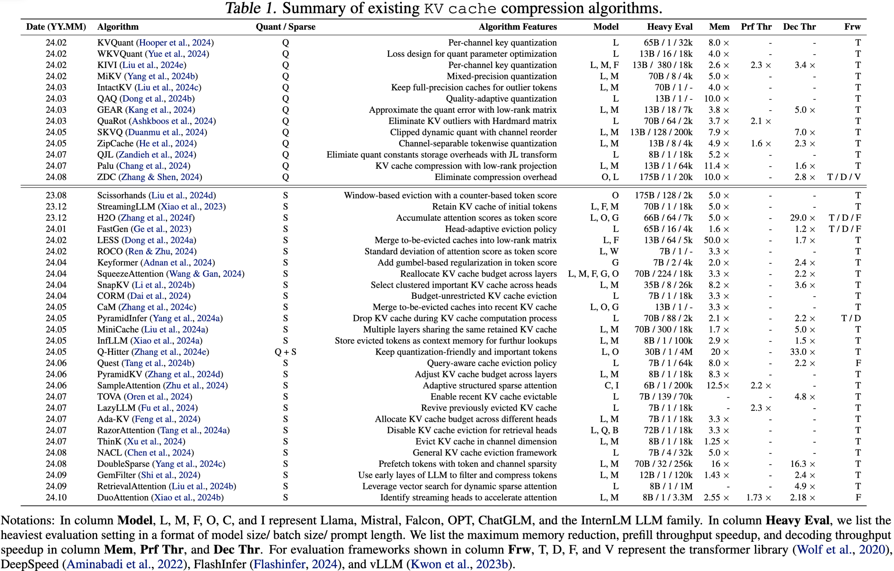

including paper: [Rethinking Key-Value Cache Compression Techniques for Large Language Model Serving](https://mlsys.org/virtual/2025/poster/3236)

# 背景

### **现有压缩方法的分类**

- **量化方法**：将KV Cache从FP16转为低精度表示（如INT8），减少内存占用。
- **稀疏化方法**：通过移除或迁移不重要的KV对来减少内存使用。

### 问题意识

尽管已有大量压缩算法被提出，但它们在**生产环境中的实际效果**尚未得到充分验证。作者指出三个被忽视的评估维度：

- **吞吐量**
- **响应长度分布**
- **负样本（压缩后性能显著下降的样本）**

# 知识点

## 长度分布（length distributions）

在这篇论文的语境中，**“Length Distributions”（长度分布）** 指的是在使用KV缓存压缩技术后，大语言模型生成的**响应长度（Response Length）** 所呈现出的统计分布变化。

简单来说，它研究的是：**压缩模型后，模型回答是变长了、变短了，还是没变？这种变化有多大？有多少比例的请求会受到影响？**

### 详细解释

#### 1. **什么是“响应长度”？**

- 对于一个用户提问（Prompt），LLM会生成一个回答（Response）。这个回答所包含的**令牌数量**，就是响应长度。
- 例如，你问“法国的首都是什么？”，模型回答“法国的首都是巴黎。”，这个回答的令牌数就是其长度。

#### 2. **为什么KV缓存压缩会影响响应长度？**

论文指出，KV缓存压缩是一种**有损压缩**。这意味着它在减少内存使用的同时，也丢失了一些信息。这种信息丢失会改变模型内部的推理过程，从而导致其生成行为发生变化：

- **可能的补偿机制：** 模型可能会变得“啰嗦”或“不确定”，通过生成更长的文本来尝试弥补可能因压缩而丢失的语义信息，从而“凑出”一个看似合理的答案。
- **决策路径改变：** 压缩可能改变了模型对“结束符”的判断，导致它不轻易结束生成长句，从而使响应变长。

#### 3. **“长度分布”如何衡量？**

论文中通过以下方式进行分析：

- **定义长度差异（D）：**
  D=(Luncompressed−Lcompressed)/Luncompressed
  - 如果 **D 为负值**，表示压缩后响应**变长**了。
  - 如果 **D 为正值**，表示压缩后响应**变短**了。
- **绘制分布图：** 他们对大量样本进行计算，然后绘制出D的分布图（如论文中的Figure 4）。这个图直观地展示了：
  - 大部分样本的长度变化集中在哪个区间？
  - 有多少样本剧烈变长（例如，D < -50%）？
  - 分布的形状是陡峭（变化一致）还是平坦（变化差异很大）？
- **统计比例：** 他们统计了响应长度增加或减少超过50%的样本比例（如论文中的Table 5）。

### 为什么“长度分布”如此重要？

**你不能只关心吞吐量，还必须关心长度分布，因为它直接影响到最终用户体验的关键指标——端到端延迟。**

我们可以用一个简单的例子来说明：

- **假设场景：**
  - **方法A（压缩）：** 生成**每个令牌**的速度比基线快 **1.5倍**（吞吐量更高）。
  - **方法B（基线）：** 原始生成速度。
- **情况1：响应长度不变**
  - 用户问一个问题，基线模型生成了100个令牌，耗时10秒。
  - 压缩模型也生成100个令牌，但由于更快，耗时 ≈ 10 / 1.5 = **6.67秒**。
  - **结果：压缩方法大获成功！**
- **情况2：响应长度变长（论文中观察到的现象）**
  - 同样的问题，基线模型生成100个令牌，耗时10秒。
  - 压缩模型生成了 **150个令牌**（长度变为1.5倍）。虽然每个令牌更快，但总耗时 = (150 / 100) * 10 / 1.5 = **10秒**。
  - **结果：吞吐量的提升被更长的响应完全抵消了！端到端延迟没有任何改善。**

如果响应变得过长，比如生成了200个令牌，那么总耗时甚至会变成 **13.3秒**，**反而比不压缩还要慢**。

